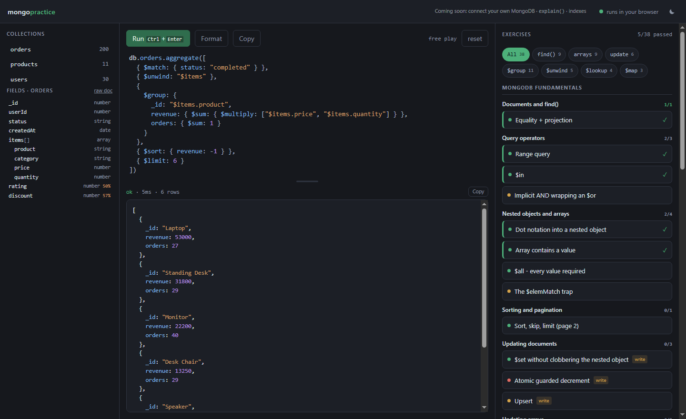
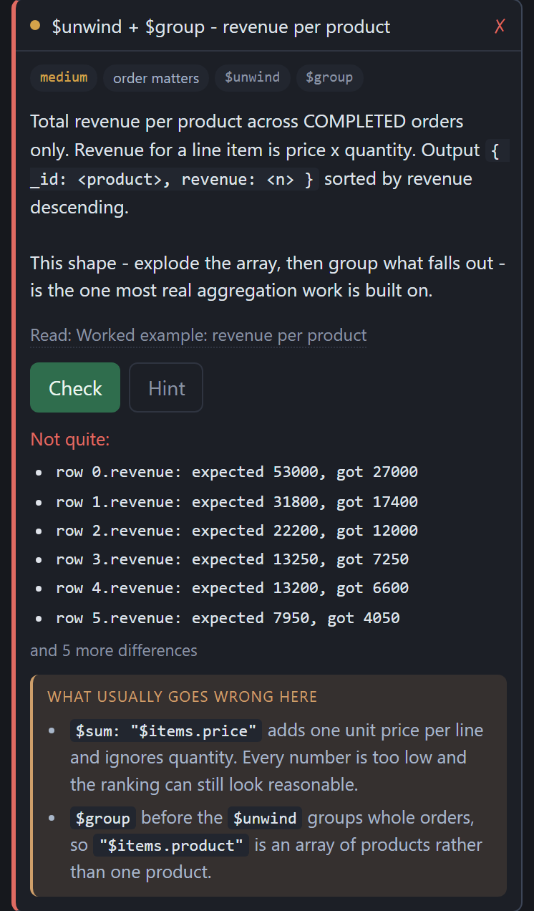
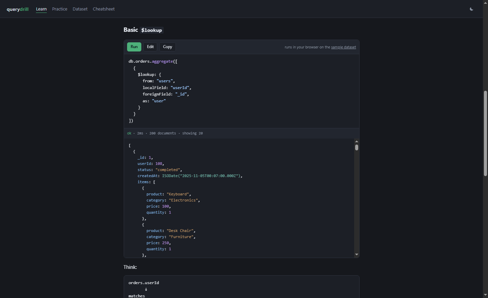

# MongoDB Practice

Learn MongoDB by running queries. 54 lessons whose examples you can run and edit
on the page they are explained on, and 38 auto-graded exercises that tell you
**why** an answer is wrong, not just that it is.

No database to install, no account, no connection string. Every query runs in
your browser.



## Why another one

Most MongoDB practice sites grade by comparing your output to a saved blob of
JSON, and tell you "incorrect". Two things here are different.

**Nothing is graded against hardcoded JSON.** Your answer and a hidden reference
solution are executed against the same data and the two results are diffed, so
the feedback is field-level — and expected answers cannot rot when the dataset
changes.

**A wrong answer explains itself.** Under the diff, every drill carries one to
three notes on what usually goes wrong, shown after a failed attempt and nowhere
else. The diff says the number is 27000 instead of 53000; the note says that
summing a unit price without its quantity is what does that.



There is also no padding. 38 exercises, one concept each — deliberately not
competing with the sites advertising "530 problems" that turn out to be
`SKU-1021`…`SKU-1025`.

## Run it

```bash
npm install
npm run dev
```

Then open <http://localhost:4321>. Needs **Node 22 or newer**.

No database, no environment variables, no accounts. Queries run through
[mingo](https://github.com/kofrasa/mingo), a pure-JavaScript implementation of
the MongoDB query language, so the built site is static files and works offline.

## First time

1. Open **Practice**. The dataset is already loaded.
2. Pick a drill from the list on the right.
3. Write your answer in the middle and press **Check**.

`Ctrl`+`Enter` runs whatever is in the editor. The left pane lists the
collections and their fields — click a field to insert its dotted path.

You do not have to start at the practice page. Every lesson has its examples
runnable in place: press **Run** to execute one, **Edit** to change it and run
your version.



## What is on the site

| | |
|---|---|
| **54 lessons** | grouped into 12 modules across 3 tracks, in [content/lessons/](content/lessons/) |
| **38 exercises** | auto-graded, with hints, an optional scaffold, and 69 "what usually goes wrong" notes |
| **7 topic hubs** | everything on the site about `$lookup`, `$unwind`, arrays and four others |
| **4 reference pages** | operator cheatsheet, how to think about a pipeline, common mistakes, and the `$match`/`$filter`-style comparisons |

The order things are taught in is [content/curriculum.js](content/curriculum.js).
That file is the map; it is not duplicated here, so there is only one place to be
wrong.

## The dataset

30 users, 200 orders and 11 products — `ecommerce`, generated from a fixed seed,
so everyone sees the same data and the exercises grade against it. It is
described field by field, with how often each optional field is present, at
[/dataset/](src/pages/dataset.astro).

Some fields are deliberately missing from some documents (`discount` on 57% of
orders, `rating` on 50%), because the drills on `$ifNull` need something real to
guard against.

Writes only affect your own tab, and a bar appears offering to put the data back
the moment a query changes anything. Nothing is uploaded, and there is nothing
to reset on a server because there is no server.

## How grading works

Your answer and a hidden reference solution are run through the same executor
against the same data, and the results are diffed. Nothing is compared to
hardcoded JSON, so expected answers cannot drift out of date when the seed data
changes.

Feedback is field-level:

```
row 0.revenue: expected 53000, got 27000
result.address.country: missing from your result (expected "India")
Wrong number of results: expected 10, got 20.
```

It is also grouped rather than dumped. One mistake is one line however many rows
it lands on, so returning raw documents where grouped totals were asked for says
that once instead of naming six fields of row 0 — and when there is more than
fits, the feedback says how much more rather than cutting silently.

Grading always builds a fresh copy of the data first, so it cannot be thrown off
by anything an earlier query changed — which is why the six **write** drills can
be run over and over and give the same answer every time.

## The editor

It behaves like the mongo shell, not like driver code:

```js
db.orders.find({ status: "completed" }).limit(5)     // no .toArray() needed
db.orders.aggregate([{ $unwind: "$items" }])
db.users.countDocuments({ skills: "MongoDB" })
```

`ObjectId`, `ISODate`, `NumberInt`, `NumberLong`, `NumberDecimal` and `print`
are all available. A bare expression is the result; for multi-statement code use
an explicit `return`:

```js
const n = await db.orders.countDocuments({});
return { total: n };
```

It is a real code editor — syntax highlighting, bracket matching, auto-indent,
`Shift`+`Alt`+`F` to format. Typing `$` completes from 90 operators, each with
what kind of operator it is and a one-line meaning, and it stays quiet inside a
string because `"$items.price"` is a field path rather than an operator. If none
of that ever loads, the plain textarea underneath still works.

## Running against a real MongoDB

The browser engine covers every exercise on the site — all 38 produce identical
output on `mingo` and on a real `mongod`, which `npm run conformance` checks
against a local server.

What it cannot do is `explain()`, indexes, or connecting your own database.
Those need a real server, which is what `local-mode/` is for — deferred, not
abandoned; see [ROADMAP.md](ROADMAP.md) section 9.

## Development

```bash
npm test         # everything that needs no database or build (~5s)
npm run verify   # the above, plus a build, link checks and a headless browser
```

Neither needs MongoDB. `npm run conformance` and `npm run selfcheck` do, and are
the only two that touch a real server.

[ARCHITECTURE.md](ARCHITECTURE.md) explains how the pieces fit and the traps
already hit. [ROADMAP.md](ROADMAP.md) is the backlog, and says what is planned,
deferred, and deliberately rejected.

`batch1.md`, `batch2.md` and `batch3.md` at the repo root are the original notes
the lessons were written from. Four sections of them have not been migrated yet,
which is the only reason they are still here. Edit the lessons, not the notes.

## Contributing

Exercises and lessons are the most useful contribution and need no database and
no build step — see [CONTRIBUTING.md](CONTRIBUTING.md). Adding one drill is a
complete contribution, and the tests will tell you what you missed rather than
expecting you to hold the whole model in your head.

## Notes on scope

This is not trying to replace **MongoDB Compass**. Install Compass too: its
stage-by-stage aggregation builder is the better tool for open-ended
exploration. What this adds is the graded exercise ladder and lessons you can
run as you read them, which Compass has no equivalent for.

## License

[MIT](LICENSE).

Not affiliated with MongoDB, Inc. MongoDB is a trademark of MongoDB, Inc.
